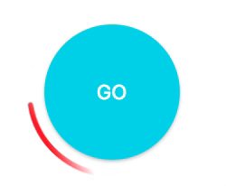

# GoButton
This button is used for displaying an animation while a request is going. It could be run with infinite animation loop or with finit animation as well.

**Current version:** *1.0.0*
## Installation 
##### Standalon:
```html
<link rel="stylesheet" href="dist/css/gobutton.css" />

<script src="jquery.min.css"></script>
<script src="dist/js/gobutton.js"></script>
```
## How to use
```html
<button class="foo"></button>
<button>Some Text</button>

<script>
    $('button').gobutton(options);
</script>
```
##### As a result:
```html
<div class="circle gobutton" style="width: 100px; height: 100px; padding: 6px;">
    <div class="loader" style="background-image: url('data:image/svg+xml;base64...'); background-color: rgba(37, 206, 209, 0.2);"></div>
    <button class="foo main circle" style="width: 100px; height: 100px; background-color: rgb(37, 206, 209);">
        
    </button>
</div>

<div class="circle gobutton" style="width: 100px; height: 100px; padding: 6px;">
    <div class="loader" style="background-image: url('data:image/svg+xml;base64...'); background-color: rgba(37, 206, 209, 0.2);"></div>
    <button class="main circle" style="width: 100px; height: 100px; background-color: rgb(37, 206, 209);">
        Some Text
    </button>
</div>
```
### Configuration
<table width="100%">
	<tr>
		<th valign="top" width="120px" align="left">Setting name</th>
		<th valign="top" align="left">Description</th>
		<th valign="top" width="60px" align="left">Type</th>
		<th valign="top" width="60px" align="left">Default value</th>
	</tr>
    <tr>
		<td valign="top"><code>size</code></td>
		<td valign="top">
        	A button size (pixels)
		</td>
		<td valign="top"><code>string</code></td>
		<td valign="top"><code>"100"</code></td>
	</tr>
    <tr>
		<td valign="top"><code>color</code></td>
		<td valign="top">
        	A button color (please, use CSS supported formats - RGB, RGBA, HEX ect.).
		</td>
		<td valign="top"><code>string</code></td>
		<td valign="top"><code>"#25CED1"</code></td>
	</tr>
    <tr>
		<td valign="top"><code>loaderGap</code></td>
		<td valign="top">
        	A gap between loader and button's body (pixels).
		</td>
		<td valign="top"><code>string</code></td>
		<td valign="top"><code>"6"</code></td>
	</tr>
    <tr>
		<td valign="top"><code>loaderWidth</code></td>
		<td valign="top">
        	A loader element width (pixels).
		</td>
		<td valign="top"><code>string</code></td>
		<td valign="top"><code>"3"</code></td>
	</tr>
    <tr>
		<td valign="top"><code>loaderColor</code></td>
		<td valign="top">
        	A loader color (RGB, RGBA or HEX format).
		</td>
		<td valign="top"><code>string</code></td>
		<td valign="top"><code>"#25CED1"</code></td>
	</tr>
    <tr>
		<td valign="top"><code>infiniteSpin</code></td>
		<td valign="top">
        	Infinite animation flag.
		</td>
		<td valign="top"><code>boolean</code></td>
		<td valign="top"><code>false</code></td>
	</tr>
    <tr>
		<td valign="top"><code>animationSpeed</code></td>
		<td valign="top">
        	A time of the initial animation (seconds). The total animation time varies depending on the "infiniteSpin" flag. If the animation is finite then its time is equal to: animationSpeed + 0.5s.
		</td>
		<td valign="top"><code>int</code></td>
		<td valign="top"><code>2.5</code></td>
	</tr>
    <tr>
		<td valign="top"><code>classes</code></td>
		<td valign="top">
        	Classes which will be added to the wrapper element.
		</td>
		<td valign="top"><code>string</code></td>
		<td valign="top"><code>""</code></td>
	</tr>
    <tr>
		<td valign="top"><code>disable</code></td>
		<td valign="top">
        	This setting adds the "disabled" attribute to the button. (Similarly to the native way - elem.disabled = true)
		</td>
		<td valign="top"><code>boolean</code></td>
		<td valign="top"><code>false</code></td>
	</tr>
    <tr>
    	<th valign="top" colspan="4" align="left">Callbacks</th>
    </tr>
    <tr>
		<td valign="top"><code>onStart()</code></td>
		<td valign="top">
        	An event that triggers when the animation starts.
		</td>
		<td valign="top"><code>function</code></td>
		<td valign="top"><code>null</code></td>
	</tr>
    <tr>
		<td valign="top"><code>onStop()</code></td>
		<td valign="top">
        	An event that triggers after the download is completed.
		</td>
		<td valign="top"><code>function</code></td>
		<td valign="top"><code>null</code></td>
	</tr>
    <tr>
		<td valign="top"><code>onAnimationStart(event)</code></td>
		<td valign="top">
        	An event that triggers after the start of each animation (see the list of animations). The parameters - animation event.
		</td>
		<td valign="top"><code>function</code></td>
		<td valign="top"><code>null</code></td>
	</tr>
    <tr>
		<td valign="top"><code>onAnimationStop(event)</code></td>
		<td valign="top">
        	An event that triggers after the end of each animation (see the list of animations). The parameters - animation event.
		</td>
		<td valign="top"><code>function</code></td>
		<td valign="top"><code>null</code></td>
	</tr>
</table>

##### Animations list
* *spin* - the main animation of the unwinding of the loader
* *infinitespin* - run after *spin*. Animation of infinite rotation, it works if the flag was set.
* *stopspoin* - run after *spin*. Animation stops rotation, it works depending on the set flag of infinite animation.
* *stop* - the rotation stop animation is triggered by a second press of the button or stopping via the stop method.

##### Methods
Available via gobutton object:
```javascript
var gobutton = $('#gobutton').gobutton(options)[0].gobutton;
gobutton.start();
```
or
```javascript
var button = document.getElementById('gobutton');
$(button).gobutton(options);
button.gobutton.start();
```
<table width="100%">
    <tr>
		<th valign="top" width="120px" align="left">Name</th>
		<th valign="top" align="left">Description</th>
	</tr>
    <tr>
		<td valign="top"><code>start()</code></td>
		<td valign="top">
        	Method which run animation.
		</td>
	</tr>
    <tr>
		<td valign="top"><code>stop()</code></td>
		<td valign="top">
        	Method which run stop animation.
		</td>
	</tr>
    <tr>
		<td valign="top"><code>infiniteStart(speed)</code></td>
		<td valign="top">
        	Run infinite roatation animation. In parametr get time of one spin in seconds.
		</td>
	</tr>
    <tr>
		<td valign="top"><code>changeOption(nameOrOptions, valueOrNothing || {})</code></td>
		<td valign="top">
        	Change one of options. In parametr get option name and value, or options object.
		</td>
	</tr>
</table>

## Examples 
##### <a href="examples/base usage/base_usage.html" target="_blank">Base usage</a>
```html
    <button>GO</button>
    <script type="text/javascript">
        $('button').gobutton();
    </script>
```

##### <a href="examples/custom size with infinite spin/custom_size_with_infinite_spin.html" target="_blank">Custom size with infinite spin</a>
```html
    <button>GO</button>
    <script type="text/javascript">
        $('button').gobutton({
            size: 150,
            loaderGap: '20',
            loaderWidth: '3',
            loaderColor: 'rgb(255,0,0)',
            infiniteSpin: true
         });
    </script>
```


To make the loader rotation smoother, it should be supplemented with a semitransparent background of the same color. But there are cases when it loses its nicety: too large button sizes (>100 pixels), a big gap between the button and the loader, low animation speed. Therefore, in these cases, you have to remove the background by writing the following style to the loader:
```html
<style>
  .loader {
    background-color: transparent!important;
  }
</style>
```

## Troubleshooting
Problems? Check the [Issues](issues) block 
to find the solution or create an new issue that we will fix asap. Feel free to contribute.
## Author
This jQuery plugin is open-sourced by [Agilie Team](https://www.agilie.com) ([info@agilie.com](mailto:info@agilie.com))
## Contributor
[Bohdan Zolotukhyn](https://github.com/fargo23) ([bohdan.zolotukhin@agilie.com](mailto:bohdan.zolotukhin@agilie.com))
## License
The [MIT](LICENSE.md) License (MIT) Copyright © 2017 [Agilie Team](https://www.agilie.com)